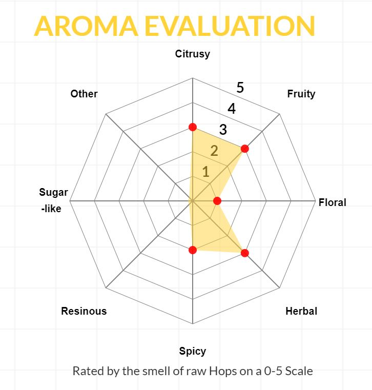

# beer generator
Automatically generate beer recipe based on user requirements.

 Project will start with creating the hop schedule for making a beer with a particular hop profile based on user preferences. Hops have different properties that determine bitterness, flavor, and aroma for a beer. 

Alpha acids in the hops ad bitterness to the beer when heated. bitterness is measured in IBUs, International Bittering Units, and hops have a percentage of alpha acids that can be used to calculate amount of IBUs added to the beer.
Hops have other volatile oils that determine flavor and aroma. These oils can be expressed in a spider graph that shows flavor profile for the beer.

   For instance, this is a graph for Cascade hop that is considered a citrusy hop:

  User would specify desired hop profile based on:
  
 * Desired Bitterness profile
 * Desired levels of different flavors (Citrusy, Resinous, Floral, Fruity,....)

